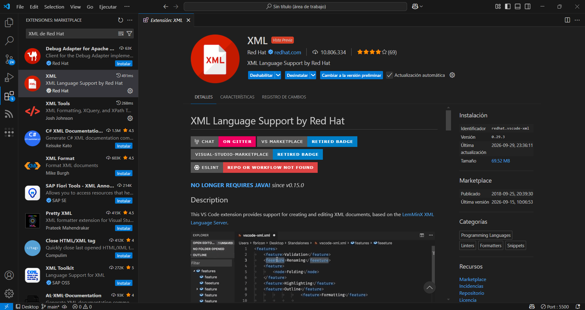
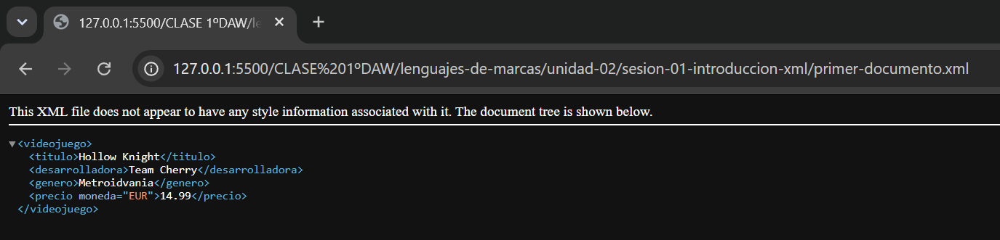
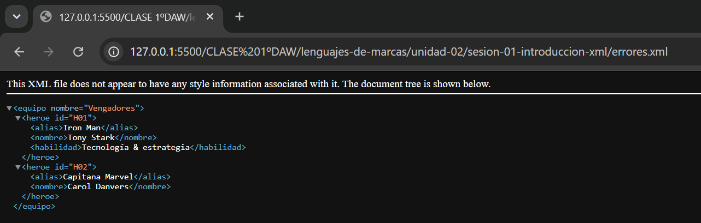
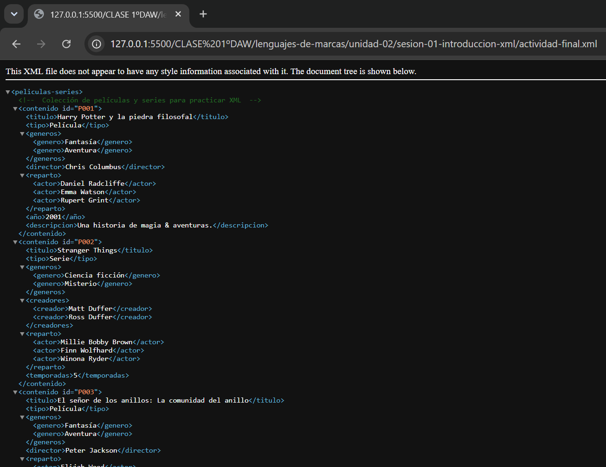

# Sesión 1. Introducción práctica a XML

**Módulo:** Lenguajes de Marcas y Sistemas de Gestión de Información

**Curso:** 1.º DAW

**Alumna:** Keyla de León Jacinto

> Primera actividad práctica de XML realizada durante el módulo.

## 1. Preparación

He utilizado **Visual Studio Code** y la extensión **XML de Red Hat** para trabajar con archivos XML.

## 2. ¿Qué es XML?

XML significa **eXtensible Markup Language**. Es un lenguaje que permite **organizar y representar información mediante etiquetas**.

Se utiliza para:

* Intercambiar información.
* Archivos de configuración.
* RSS.
* Organizar datos.

**Fuentes:**

* [MDN — Introducción a XML](https://developer.mozilla.org/es/docs/Web/XML/Guides/XML_introduction)
* [MDN — XML](https://developer.mozilla.org/es/docs/Glossary/XML)

## 3. Primer documento XML

He creado mi primer documento XML sobre un **videojuego**.

He aprendido a identificar:

* Elementos.
* Atributos.
* Valores.
* Elemento raíz.
* Elementos hermanos.

## 4. Catálogo de videojuegos

He creado un catálogo con **10 videojuegos**.

He utilizado:

* Identificadores.
* Títulos.
* Desarrolladoras.
* Plataformas.
* Precios.
* Descripciones.
* Comentarios XML.

## 5. Laboratorio de errores

He trabajado con un XML que contenía errores y los he corregido.

He aprendido que las etiquetas deben coincidir, los atributos necesitan comillas, los elementos deben cerrarse y algunos caracteres especiales deben escribirse correctamente.

## 6. Actividad final

**Tema:** Películas y series 🎬

He creado una colección de películas y series utilizando XML.

Incluye títulos, tipos, géneros, actores, directores, años y otros datos.

## 7. Lo aprendido

Con esta actividad he aprendido los **conceptos básicos de XML**, su estructura, sus elementos y atributos, y cómo detectar y corregir errores.

## 8. Entrega

Los archivos y capturas están organizados dentro de:

`unidad-02/sesion-01-introduccion-xml/`

El trabajo será subido a **GitHub** mediante Git.
